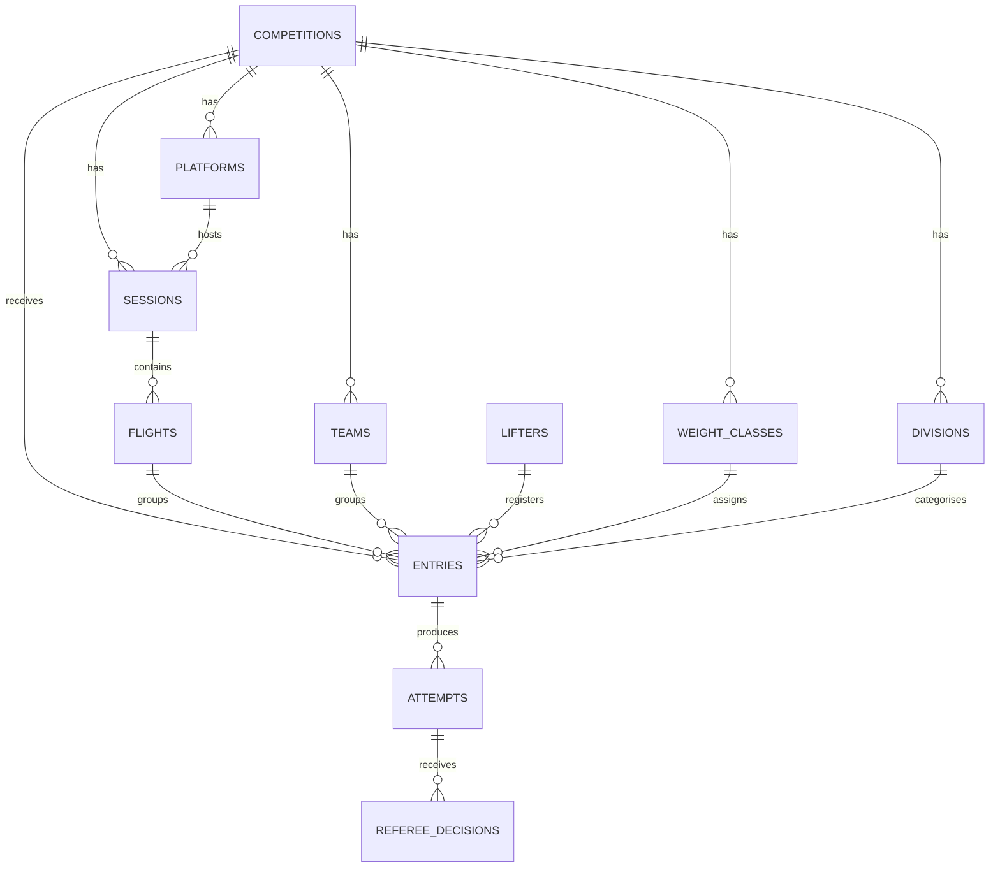

# Comp-Software — Architecture

This document captures the system design. Read it alongside `CLAUDE.md` before substantial work on the codebase.

---

## 1. System overview

Four front-end surfaces share one backend.

- **Admin** (`/(admin)`): staff interfaces with full chrome. Auth required. Admins set up comps, run flights, and manage declarations. Gated server-side via `requireAdmin()` and at the database via RLS.
- **Display** (`/(display)`): full-screen venue display screens (e.g. the loading-crew display and the warm-up board), admin-gated like Admin via the same `requireAdminPage()` gate, but with no chrome — the display owns the whole viewport, so no nav/header sits behind its full-screen overlay. Read-only, real-time.
- **Overlay** (`/(overlay)`): OBS browser sources. Transparent background, fixed pixel dimensions (typically 1920×1080 or sub-regions). No chrome, no navigation. An OBS Browser Source renders the page's alpha natively, so transparency needs no chroma key. Each overlay subscribes to real-time and renders one piece of data. Read anonymously via the public-comp RLS policies (like the public live views), not the admin session — an OBS Browser Source is a headless browser with its own cookie jar and does not inherit the operator's admin session, so an admin-gated overlay would render empty. See the ADR in section 7.
- **Public** (`/(public)`): comp landing pages, a public **live scoreboard** (planned, at `/[comp]/live`) for venue TVs and social shares, final results, and the **public warm-up board** (`/[comp]/live/warm-up`) — a sign-in-free copy of the Display warm-up board for sharing with lifters/spectators. Read-only, no auth gate; anon reads are scoped by RLS to publicly-visible comps and lifter names come from the PII-free `public_lifters` view.

Backend services:

- **Supabase** (Postgres, Auth, Realtime) is the only data store. RLS on every table.
- **Vercel** hosts Next.js (production plus preview deployments per PR).
- **Resend** is the SMTP provider for Supabase auth emails (password reset, and OTP once production sign-in switches to it).
- **Sentry** receives client, server, and edge errors plus performance traces.

---

## 2. Data model

The migration files in `/supabase/migrations` are the source of truth. The diagram below is for orientation.

### Table summaries

- **competitions**: the meet. Slug, name, federation, kit_type (classic/equipped), event_type (full_power/bench_only/deadlift_only), date range, status (draft/published/active/completed), is_team_competition (team-format flag, full power only).
- **divisions**: age categories per comp (Open, Junior, Sub-junior, Masters 1-4).
- **weight_classes**: bodyweight categories per comp with gender, lower_kg, upper_kg.
- **platforms**: physical lifting platforms (one per comp normally, two for bigger meets).
- **sessions**: a chunk of lifting tied to a date, time, and platform.
- **flights**: a group of ~8-14 lifters within a session who lift together.
- **lifters**: the persistent person. First name, surname, gender, DOB, IPF member ID, club, country.
- **entries**: a lifter registering for one comp. Weight class, division, flight, lot number, bodyweight at weigh-in, opener attempts, and structured rack settings (integer squat rack height + position, integer bench and safety heights + spotting choice — `squat_rack_setting` / `bench_spotting` enums), status. In team competitions, team_id and team_lift link the entry to a team and its one assigned discipline.
- **teams**: (team competitions only) a named team within a comp. Its members are entries tagged with team_id and team_lift — one per discipline (squat/bench/deadlift). The team score is the sum of the three members' IPF GL points.
- **attempts**: up to 9 per entry (3 squats, 3 benches, 3 deadlifts). Weight in kg, declared timestamp, decided timestamp (`decided_at`, set when a good/no lift is recorded — anchors the run screen's 60-second next-attempt countdown across devices), result (pending/good_lift/no_lift/not_taken/withdrawn).
- **referee_decisions**: exactly 3 per attempt (left/head/right positions). Decision (white/red) plus reasons array for no-lifts.
- **profiles**: extends `auth.users` with display_name.

---

## 3. Permissions

Admins (email in `ADMIN_EMAILS`) can do everything. Anon can read data belonging to publicly visible competitions (status `published`, `active`, or `completed`). That's it — there are no per-comp roles.

There is no permissions matrix or `requireRole` API in the codebase — `requireAdmin()` against `ADMIN_EMAILS` (`lib/auth/admin.ts`) plus the RLS predicates are the whole model.

Enforcement: RLS grants every write to any authenticated session, and `requireAdmin()` in server actions is the real gate. This holds only because public sign-ups are disabled, so admins are the sole session holders (see section 5 and the ADR in section 7). Anon reads are gated by the `is_comp_public()` RLS predicate. Lifter PII (date of birth, IPF member ID) is never exposed to anon: the public reads the `public_lifters` view, which omits those columns and is scoped to lifters who appear in a publicly visible comp (`lifter_in_public_comp()`).

---

## 4. Real-time subscription map

Which screens subscribe to which tables.

| Screen | Subscribes to | Filter |
|--------|---------------|--------|
| `/(admin)/[comp]/run` | attempts, entries, flights | `competition_id` |
| `/(display)/[comp]/loading` | attempts, entries, flights | `competition_id` (display scoped to one platform via `?platform`) |
| `/(display)/[comp]/warm-up` | attempts, entries, flights | `competition_id` (display scoped to one platform via `?platform`) |
| `/(public)/[comp]/live/warm-up` | attempts, entries, flights | `competition_id` (public warm-up board, scoped to one platform via `?platform`; anon, RLS-gated to public comps) |
| `/(admin)/[comp]/rack-heights` | entries, flights | `competition_id` |
| `/(admin)/[comp]/flights` | flights, entries | `competition_id` |
| `/(overlay)/[comp]/scoreboard` | attempts, entries | `competition_id` + current session |
| `/(overlay)/[comp]/lifter` | attempts, entries, flights | `competition_id` (anon, RLS-gated to public comps; current lifter derived per platform via `?platform`) |
| `/(overlay)/[comp]/attempt` | attempts, referee_decisions | current `attempt_id` |
| `/(overlay)/[comp]/weight-class` | attempts, entries | `competition_id` + visible weight class |
| `/(public)/[comp]/live` | attempts, entries | `competition_id` |
| `/(public)/[comp]/results` | attempts, entries | `competition_id` (team comps only; anon, RLS-gated to public comps; teams have no channel — a rename/new team appears on next load) |

Subscription hooks live in `/lib/realtime` as typed wrappers (`useAttemptsSubscription`, `useEntriesSubscription`, `useFlightsSubscription`, etc.). Components never subscribe inline.

The `referee_decisions` subscriptions (for `/run` and the attempt overlay) are deferred until 3-light refereeing is built: the scorekeeper currently records a good/no lift directly on the attempt rather than from per-referee decisions, so the overlays/run consume `attempts` for the result. Add the `referee_decisions` subscription when that table starts being written.

Subscriptions inherit RLS: if a user can't read a row via a regular query, they won't receive change events for it either.

---

## 5. Auth model

- Supabase Auth handles sessions.
- Email + password sign-in for admins in the initial build; production switches to 6-digit OTP (see the ADR in section 7). Either way the sign-in method only changes the authentication ceremony — `requireAdmin()` against `ADMIN_EMAILS` stays the authorization gate. Public sign-ups are disabled, so the only accounts that can hold a session are the admin emails listed in `ADMIN_EMAILS`.
- The public has no accounts and no sign-in — they read published-comp data anonymously.
- `requireAdmin()` (in `/lib/auth`) is the authorization gate at the server-action boundary; it checks the session's email against `ADMIN_EMAILS`. Because RLS grants writes to any authenticated session, this helper is the real write gate — and that is only safe while public sign-ups stay disabled.
- RLS policies on Postgres enforce row-level access: anon reads publicly visible competitions only; authenticated (admin) sessions read and write everything.
- `proxy.ts` middleware refreshes and passes through the Supabase session cookie.
- Overlays run on the admin's own machine using the admin session — there is no separate overlay auth.

---

## 6. Deployment topology

- **Vercel**: Next.js host. Production deploys from `main`. PR branches get preview deployments automatically. Custom domain points here.
- **Supabase**: Postgres + Auth + Realtime gateway. One project per environment (dev, staging, production).
- **Resend**: SMTP provider for Supabase auth emails. Single account, multiple sending domains as needed.
- **Sentry**: errors and performance traces. One project per environment, source maps uploaded on every Vercel deployment.
- **GitHub**: repo host. PRs trigger Vercel previews and Sentry release tagging.

There is no local development environment: all work runs against the hosted Supabase dev project and Vercel preview deployments, never a local Next.js or Supabase instance.

Environment variables documented in `.env.example`.

---

## 7. Architectural decisions

A brief log of "why we chose X over Y". Append to this when making future decisions worth recording.

### Lifters and entries split into two tables

The same person enters multiple comps over multiple years. The `lifters` table holds the persistent person; `entries` holds a registration for one comp. Trades a small join cost for clean lifter history, re-usable contact details, and a clean place to link IPF member records.

### Attempts as rows, not columns

Storing 9 attempts as 9 columns on `entries` would make real-time updates push the entire entry payload for every single attempt change. Rows let Supabase publish one attempt at a time, keeping the broadcast frequency high and the payloads small.

### Referee decisions split from attempts

Per-position decisions in a separate table enables future digital ref login with per-ref timestamps, reason codes per referee, and jury overrides as additional rows. Pays a small read-cost penalty for substantial future flexibility.

### Online-first, not offline-first

Our venue wifi is controlled and reliable. LiftingCast's offline-first architecture (PouchDB sync, conflict resolution) carries significant complexity that is not warranted at our risk profile. Revisit if we expand to venues outside our control.

### Multi-platform support from v1

Some IPF comps run two platforms simultaneously. Designing this out of v1 would force a painful migration later. The cost in v1 is one extra column (`platform_id` on `sessions`).

### Three route groups, three layouts

Admin, overlay, and public surfaces have radically different chrome, transparency, and access models. Next.js route groups isolate each surface's root layout without affecting URL structure.

### Server actions for all writes

No direct Supabase writes from the client. Every mutation passes through a server action wrapped in `Sentry.withServerActionInstrumentation`, validated by Zod, and authorised via `requireAdmin()`. The cost is a slightly chattier request layer; the benefit is one unambiguous audit and validation point per mutation.

### Simplified from role-based permissions to admin allowlist + anon read

Original model assumed multi-organisation use with a per-comp role matrix (`comp_roles`, `requireRole`). In practice this is a single-gym tool with 1-2 admins, so the matrix added complexity without value at this scale. Replaced with an `ADMIN_EMAILS` allowlist checked by `requireAdmin()` plus anonymous public read of published comps. Revisit only if multi-tenant becomes a real requirement.

### Overlays read anonymously via public-comp RLS, no separate overlay auth

Overlays run in OBS as Browser Sources. A Browser Source is a headless Chromium instance with its **own** cookie jar — it does not share the operator's logged-in browser session, so it cannot rely on the admin session even though it runs on the admin's machine. Rather than reintroduce a per-comp overlay key or signed URL (the original `overlay_key` was removed — see "Simplified from role-based permissions…"), overlays read **anonymously through the same publicly-visible-comp RLS policies the public live views use**: every table read is scoped by `is_comp_public()` / `lifter_in_public_comp()`, and lifter names come from the PII-free `public_lifters` view. This works in the headless Browser Source with zero auth setup, at the cost that overlays only show data once the comp is `published`/`active`/`completed` (acceptable — overlays are a broadcast tool, used during a live, public meet). Revisit (e.g. a signed overlay URL) only if an overlay ever needs to show a non-public comp.

(Earlier design ran overlays on the admin session on the assumption the Browser Source would inherit it; it does not, hence the move to anon public reads above.)

### Competition setup stays editable at any status

Setup writes (competition metadata, divisions, weight classes, and lifter registration / weigh-in entries) are not gated on `status`: an operator can edit a `completed` comp's details, not just a `draft` one. The "no writes to a completed comp" rule is a meet-time concern for attempts, referee decisions, and results — not for the setup tables, where late corrections (a misspelled name, a wrong date, a weigh-in adjustment) are legitimate. `requireAdmin()` remains the gate. The attempt/result write paths, when built, should enforce their own status checks. Two deliberate exceptions on the setup side, both blocked once a comp is `completed` because they cascade to attempts and referee decisions and would destroy the final record: deleting *all* entrants at once (`deleteAllEntriesAction`) and deleting the whole competition (`deleteCompetitionAction`). Single-entry edits — and duplicating a comp, which only reads the source — stay allowed at any status.

### Password sign-in for the initial build, OTP for production

The auth model targets 6-digit OTP sign-in, but the initial build ships email + password instead. The dev SMTP provider is heavily rate-limited (a couple of emails per hour) and email deliverability is unreliable until a production sending domain is registered with Resend, which makes OTP painful to operate and test at this stage. Password sign-in needs no email round-trip and works immediately for the two manually-provisioned admin accounts. This is purely an authentication-ceremony choice: `requireAdmin()` against `ADMIN_EMAILS` remains the authorization gate, RLS is unchanged, and public sign-ups stay disabled, so the security posture is the same either way. Supabase supports both methods simultaneously, so switching to (or adding) OTP for production is a matter of swapping the sign-in action — no other code changes. Production should move to OTP, and admin passwords should be strengthened before the app is exposed publicly.

### Team competitions: members are tagged entries, scored on full-power GL

A competition can opt into a team format (`is_team_competition`, full power only). A team is three lifters — one each on squat, bench and deadlift — and each member contests only their assigned lift. The team score is the sum of the three members' IPF GL points, each taken from that member's best lift; teams rank by that total and individuals do not place in this format.

Members are modelled as ordinary `entries` tagged with `team_id` + `team_lift` (one member per lift per team, enforced by a partial unique index plus a check that the two columns are set together), rather than a separate membership table. This lets the existing registration, flight and attempt paths reuse the entry unchanged; deleting a team unassigns its members via `ON DELETE SET NULL` instead of removing their registrations. On the sessions & flights screen, team comps assign whole teams to a flight at once (every member's entry moves together) rather than placing individual lifters.

GL uses the full-power (3-lift) coefficients for all three roles. The IPF publishes GL coefficients only for full powerlifting and for bench-only — there is no official single-squat or single-deadlift set — so scoring every role on the full-power coefficients keeps the three contributions on one comparable scale. This is a deliberate house rule for the format, not an official IPF score.
