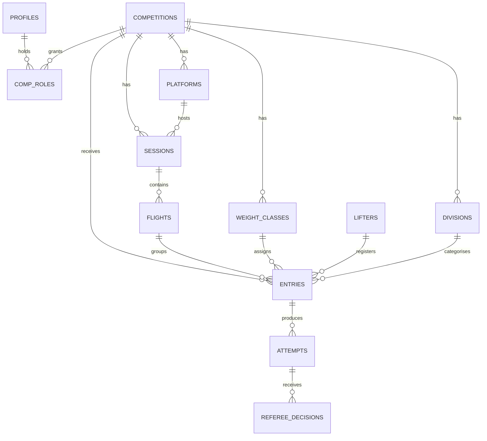

# Comp-Software — Architecture

This document captures the system design. Read it alongside `CLAUDE.md` before substantial work on the codebase.

---

## 1. System overview

Three user-facing surfaces share one backend.

- **Admin** (`/(admin)`): staff interfaces with full chrome. Auth required. Meet directors set up comps, scorekeepers run flights, table loaders manage declarations. Role-gated server-side via `requireRole()` and at the database via RLS.
- **Overlay** (`/(overlay)`): OBS browser sources. Transparent background, fixed pixel dimensions (typically 1920×1080 or sub-regions). No chrome, no navigation. Read-only access via per-comp overlay key in the URL. Each overlay subscribes to real-time and renders one piece of data.
- **Public** (`/(public)`): comp landing pages, live scoreboard for venue TVs and social shares, final results. Read-only.

Backend services:

- **Supabase** (Postgres, Auth, Realtime) is the only data store. RLS on every table.
- **Vercel** hosts Next.js (production plus preview deployments per PR).
- **Resend** is the SMTP provider for Supabase auth emails (OTP, password reset).
- **Sentry** receives client, server, and edge errors plus performance traces.

---

## 2. Data model

The migration files in `/supabase/migrations` are the source of truth. The diagram below is for orientation.

### Table summaries

- **competitions**: the meet. Slug, name, federation, kit_type (classic/equipped), event_type (full_power/bench_only/deadlift_only), date range, status (draft/published/active/completed), overlay_key.
- **divisions**: age categories per comp (Open, Junior, Sub-junior, Masters 1-4).
- **weight_classes**: bodyweight categories per comp with gender, lower_kg, upper_kg.
- **platforms**: physical lifting platforms (one per comp normally, two for bigger meets).
- **sessions**: a chunk of lifting tied to a date, time, and platform.
- **flights**: a group of ~8-14 lifters within a session who lift together.
- **lifters**: the persistent person. First name, surname, gender, DOB, IPF member ID, club, country.
- **entries**: a lifter registering for one comp. Weight class, division, flight, lot number, bodyweight at weigh-in, opener attempts, rack heights, status.
- **attempts**: up to 9 per entry (3 squats, 3 benches, 3 deadlifts). Weight in kg, declared timestamp, result (pending/good_lift/no_lift/not_taken/withdrawn).
- **referee_decisions**: exactly 3 per attempt (left/head/right positions). Decision (white/red) plus reasons array for no-lifts.
- **profiles**: extends `auth.users` with display_name.
- **comp_roles**: links a user to a comp with a role.

---

## 3. Permission matrix

Source of truth lives in `/lib/permissions/matrix.ts`. This table mirrors it for documentation. Operations: R (read), W (write), - (no access).

| Resource | meet_director | scorekeeper | table_loader | announcer | viewer (public) |
|----------|---------------|-------------|--------------|-----------|-----------------|
| competitions | R/W | R | R | R | R (published only) |
| divisions | R/W | R | R | R | R |
| weight_classes | R/W | R | R | R | R |
| platforms | R/W | R | R | R | R |
| sessions | R/W | R | R | R | R |
| flights | R/W | R/W | R | R | R |
| lifters | R/W | R/W | R/W | R | R |
| entries | R/W | R/W | R/W | R | R |
| attempts | R/W | R/W | R/W (declared weight only) | R | R |
| referee_decisions | R/W | R/W | R | R | R |
| comp_roles | R/W | R | R | R | - |

Public read on `lifters` is scoped: a public user can read a lifter row only if that lifter has an entry in a published competition. The full lifter directory remains private to staff (any comp_roles row). This is enforced in RLS and reflected in `/lib/permissions/matrix.ts` as a custom predicate, not a simple R/W flag.

v2 roles:

- **referee**: read all, write own referee_decisions only
- **jury**: read all, write referee_decisions overrides

The matrix is enforced in two places: RLS policies on Postgres tables, and `requireRole()` checks at the top of server actions. Both must agree. The matrix file has 100% unit test coverage as a guard against drift.

---

## 4. Real-time subscription map

Which screens subscribe to which tables.

| Screen | Subscribes to | Filter |
|--------|---------------|--------|
| `/(admin)/[comp]/run` | attempts, referee_decisions, entries | `competition_id` |
| `/(admin)/[comp]/flights` | flights, entries | `competition_id` |
| `/(overlay)/[comp]/scoreboard` | attempts, entries | `competition_id` + current session |
| `/(overlay)/[comp]/lifter` | attempts, entries | `competition_id` + current attempt |
| `/(overlay)/[comp]/attempt` | attempts, referee_decisions | current `attempt_id` |
| `/(overlay)/[comp]/weight-class` | attempts, entries | `competition_id` + visible weight class |
| `/(public)/[comp]/live` | attempts, entries | `competition_id` |

Subscription hooks live in `/lib/realtime` as typed wrappers (`useAttemptsSubscription`, `useFlightSubscription`, etc.). Components never subscribe inline.

Subscriptions inherit RLS: if a user can't read a row via a regular query, they won't receive change events for it either.

---

## 5. Auth model

- Supabase Auth handles sessions
- Password sign-in for staff roles (meet director, scorekeeper, table loader, ref, jury, announcer)
- 6-digit OTP for public accounts (registering for or following a comp)
- `proxy.ts` middleware: checks session, redirects unauthenticated users from protected routes
- `requireRole(competitionId, allowedRoles)` server-side helper enforces role checks at the server action boundary
- RLS policies on Postgres enforce row-level access
- Overlay access is via a per-comp `overlay_key` in the URL. No user session required. The key is read-only and revocable.

---

## 6. Deployment topology

- **Vercel**: Next.js host. Production deploys from `main`. PR branches get preview deployments automatically. Custom domain points here.
- **Supabase**: Postgres + Auth + Realtime gateway. One project per environment (dev, staging, production).
- **Resend**: SMTP provider for Supabase auth emails. Single account, multiple sending domains as needed.
- **Sentry**: errors and performance traces. One project per environment, source maps uploaded on every Vercel deployment.
- **GitHub**: repo host. PRs trigger Vercel previews and Sentry release tagging.

Environment variables documented in `.env.example`.

---

## 7. Architectural decisions

A brief log of "why we chose X over Y". Append to this when making future decisions worth recording.

### Lifters and entries split into two tables

The same person enters multiple comps over multiple years. The `lifters` table holds the persistent person; `entries` holds a registration for one comp. Trades a small join cost for clean lifter history, re-usable contact details, and a clean place to link IPF member records.

### Attempts as rows, not columns

Storing 9 attempts as 9 columns on `entries` would make real-time updates push the entire entry payload for every single attempt change. Rows let Supabase publish one attempt at a time, keeping the broadcast frequency high and the payloads small.

### Referee decisions split from attempts

Per-position decisions in a separate table enables future digital ref login with per-ref timestamps, reason codes per referee, and jury overrides as additional rows. Pays a small read-cost penalty for substantial future flexibility.

### Online-first, not offline-first

Our venue wifi is controlled and reliable. LiftingCast's offline-first architecture (PouchDB sync, conflict resolution) carries significant complexity that is not warranted at our risk profile. Revisit if we expand to venues outside our control.

### Password sign-in for staff, OTP for public

OTP at a venue is friction for staff who sign in repeatedly across multiple devices. Passwords for staff, OTP reserved for public-facing accounts that sign in rarely.

### Multi-platform support from v1

Some IPF comps run two platforms simultaneously. Designing this out of v1 would force a painful migration later. The cost in v1 is one extra column (`platform_id` on `sessions`).

### Three route groups, three layouts

Admin, overlay, and public surfaces have radically different chrome, transparency, and access models. Next.js route groups isolate each surface's root layout without affecting URL structure.

### Server actions for all writes

No direct Supabase writes from the client. Every mutation passes through a server action wrapped in `Sentry.withServerActionInstrumentation`, validated by Zod, and authorised via `requireRole()`. The cost is a slightly chattier request layer; the benefit is one unambiguous audit and validation point per mutation.

### Per-comp overlay key, no user session

Overlays run in OBS where there is no realistic way to maintain a session. A revocable per-comp key in the URL gives read-only access to the live data feed for that comp. The key can be rotated mid-event if leaked.
