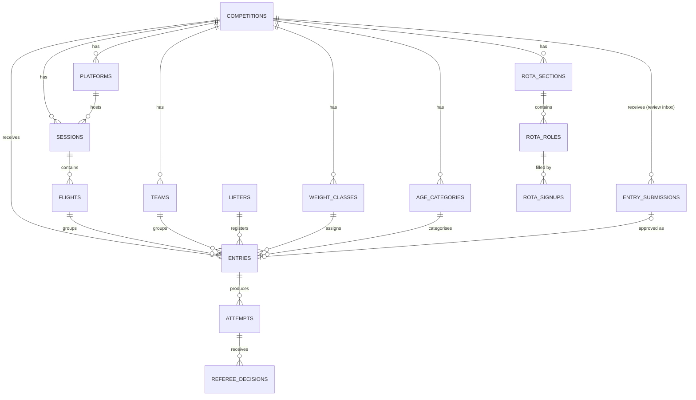

# Comp-Software — Architecture

This document captures the system design. Read it alongside `CLAUDE.md` before substantial work on the codebase.

---

## 1. System overview

Four front-end surfaces share one backend.

- **Admin** (`/(admin)`): staff interfaces with full chrome. Auth required. Admins set up comps, run flights, and manage declarations. Gated server-side via `requireAdmin()` and at the database via RLS.
- **Display** (`/(display)`): full-screen venue display screens (e.g. the loading-crew display), admin-gated like Admin via the same `requireAdminPage()` gate, but with no chrome — the display owns the whole viewport, so no nav/header sits behind its full-screen overlay. Read-only, real-time. (The warm-up board previously lived here too; it is now a single sign-in-free Public board — see below — since it is read-only and the run screen is the sole data-mutation gate.)
- **Overlay** (`/(overlay)`): OBS browser sources. Transparent background, fixed pixel dimensions (typically 1920×1080 or sub-regions). No chrome, no navigation. An OBS Browser Source renders the page's alpha natively, so transparency needs no chroma key. Each overlay subscribes to real-time and renders one piece of data. Read anonymously via the public-comp RLS policies (like the public live views), not the admin session — an OBS Browser Source is a headless browser with its own cookie jar and does not inherit the operator's admin session, so an admin-gated overlay would render empty. See the ADR in section 7.
- **Public** (`/(public)`): comp landing pages, a public **live scoreboard** (planned, at `/[comp]/live`) for venue TVs and social shares, final results, the **warm-up board** (`/[comp]/warm-up`) — a sign-in-free read-only mirror of the run-screen scoresheet for the warm-up room and for sharing with lifters/spectators — the **entry form** (`/[comp]/enter`) — lifters self-register into the comp's review inbox; the one public surface that *writes* (a single INSERT into `entry_submissions`, see §3) — and the **UK records browser** (`/records`), an app-global, sign-in-free table of regional/national records (not tied to any comp). No auth gate; comp-scoped anon reads are gated by RLS to publicly-visible comps with lifter names from the PII-free `public_lifters` view, while the records browser reads the always-public `records` table (see §3 and the ADR in §7).

Backend services:

- **Supabase** (Postgres, Auth, Realtime) is the only data store. RLS on every table.
- **Vercel** hosts Next.js (production plus preview deployments per PR).
- **Resend** is the SMTP provider for Supabase auth emails (password reset, and OTP once production sign-in switches to it).
- **Sentry** receives client, server, and edge errors plus performance traces.

---

## 2. Data model

The migration files in `/supabase/migrations` are the source of truth. The diagram below is for orientation.

### Table summaries

- **competitions**: the meet. Slug, name, federation (`'ipf'` = standard IPF categories seeded and locked, `'custom'` = operator-built; text with a CHECK constraint, fixed at creation — see the ADR in §7), kit_type (classic/equipped), event_type (full_power/bench_only/deadlift_only), date range, status (draft/published/active/completed), is_team_competition (team-format flag, full power only), entry_form (jsonb — the public entry form's design: which fields are off/optional/required plus the disclaimer text; shaped and validated by Zod in `types/entry-form.ts`, a corrupt/legacy value reads as the defaults) and entry_form_open (the accepting-entries toggle); plus rota_open (the volunteer-rota accepting-sign-ups toggle) and rota_withdrawal_contact (the rota board's "who to message to withdraw or change a slot" line).
- **age_categories**: age categories per comp (formerly the `divisions` table — renamed so "division" can mean the BP region/home nation). The seed defaults follow British Powerlifting (U16, U18, U23, Open, M1-M6); each comp owns its own set. A placement dimension: individual placement is weight class × age category × sex.
- **weight_classes**: bodyweight categories per comp with gender, lower_kg, upper_kg (both 2 dp, inclusive bounds — each class's lower bound is the class below's upper + 0.01 kg, so a boundary is unambiguous: 83.00 kg is -83, 83.01 kg is -93).
- **platforms**: physical lifting platforms (one per comp normally, two for bigger meets).
- **sessions**: a chunk of lifting tied to a date, time, and platform.
- **flights**: a group of ~8-14 lifters within a session who lift together.
- **lifters**: the persistent person. First name, surname, gender, DOB, IPF member ID, club, country.
- **entries**: a lifter registering for one comp. Weight class, age category (`age_category_id`), division (`division` — the BP region / home nation the lifter competes on behalf of; free-text column constrained by the app to the fixed `BP_DIVISIONS` list, informational only and not a placement dimension), flight, lot number, bodyweight at weigh-in, opener attempts, and structured rack settings (integer squat rack height + position, integer bench and safety heights + spotting choice — `squat_rack_setting` / `bench_spotting` enums), status. In team competitions, team_id and team_lift link the entry to a team and its one assigned discipline.
- **teams**: (team competitions only) a named team within a comp. Its members are entries tagged with team_id and team_lift — one per discipline (squat/bench/deadlift). The team score is the sum of the three members' IPF GL points.
- **attempts**: up to 9 per entry (3 squats, 3 benches, 3 deadlifts). Weight in kg, declared timestamp, decided timestamp (`decided_at`, set when a good/no lift is recorded — anchors the run screen's 60-second next-attempt countdown across devices), result (pending/good_lift/no_lift/not_taken/withdrawn).
- **referee_decisions**: exactly 3 per attempt (left/head/right positions). Decision (white/red) plus reasons array for no-lifts.
- **entry_submissions**: the public entry form's holding inbox — a lifter's self-registration waiting for admin review (status pending/approved/rejected). Always carries name, gender and date of birth; the admin-toggled fields (club, membership number, division, weight class name, predicted total, best comp total from the last 12 months, kit/event preference, instagram, email, phone) are nullable and enforced per the comp's form design at submission time. Approval creates the real `lifters`/`entries` rows through the existing registration path and stamps the submission (entry_id, reviewed_at, reviewed_by); submissions never feed any board or public view. The only table with an anon INSERT policy (insert-only, gated by `comp_accepts_entries()`; no anon read — submissions carry PII). See the ADR in section 7.
- **profiles**: extends `auth.users` with display_name.
- **records**: UK regional/national powerlifting records — **app-global reference data, not tied to any competition** (no `competition_id`, no foreign keys). Region (free text — the British/home-nation/sub-national tier is implied by the value), record holder name (free text), gender ('M'/'F'), weight_class, age_category, lift (`record_lift` enum: squat/bench_press/bench_press_ac/deadlift/total), equipment (`record_equipment` enum), weight_kg, date_set, notes. Case-insensitively unique on (region, gender, weight_class, age_category, lift, equipment) via `citext`. Admin-managed (`/records/manage`); always anon-readable (the public browser at `/records`). See the ADR in section 7.
- **rota_sections**: (volunteer staff rota) a column of the rota grid for a comp — an optional `day_label` banner (e.g. "Sat"), a `title` (e.g. "AM", "Set-up"), an optional free-text `subtitle` (weigh-in / lift-off times), and `sort_order`. Admin-built; independent of the comp's `sessions`/`flights`.
- **rota_roles**: a job within a section — `title` (e.g. "Spotters / Loaders"), optional `arrive_by` time, and `capacity` (how many volunteers the role needs, ≥ 1). Carries `competition_id` (denormalised from the section for the RLS predicate + realtime filter, as `attempts` carry it alongside `entry_id`).
- **rota_signups**: a volunteer claiming a slot — `name` (the only field the public sees, via the `public_rota_signups` view), plus admin-only `email` and `phone`. Unique on `(role_id, lower(email))` so one person holds a slot once; a `BEFORE INSERT` trigger enforces the role's `capacity`. The app's second anonymous-write table (INSERT-only for anon). See the ADR in section 7.

---

## 3. Permissions

Admins (email in `ADMIN_EMAILS`) can do everything. Anon can read data belonging to publicly visible competitions (status `published`, `active`, or `completed`). That's it — there are no per-comp roles.

There is no permissions matrix or `requireRole` API in the codebase — `requireAdmin()` against `ADMIN_EMAILS` (`lib/auth/admin.ts`) plus the RLS predicates are the whole model.

Enforcement: RLS grants every write to any authenticated session, and `requireAdmin()` in server actions is the real gate. This holds only because public sign-ups are disabled, so admins are the sole session holders (see section 5 and the ADR in section 7). Anon reads are gated by the `is_comp_public()` RLS predicate. Lifter PII (date of birth, IPF member ID) is never exposed to anon: the public reads the `public_lifters` view, which omits those columns and is scoped to lifters who appear in a publicly visible comp (`lifter_in_public_comp()`).

One deliberate exception to the "anon reads are scoped by `is_comp_public()`" rule: the `records` table (UK regional/national records) is **app-global reference data, not tied to any competition**, so its anon read policy is **unconditional** (`using (true)`). It is the only anon-readable table not gated on comp visibility. Writes still follow the standard model (authenticated + `requireAdmin()`). See the ADR in section 7.

One deliberate exception to the "the public never writes" rule: `entry_submissions` carries the app's **single anonymous write path** — the public entry form. Anon may **INSERT only** (a pending, unreviewed submission, gated by `comp_accepts_entries()`: the comp is publicly visible *and* the operator's accepting-entries toggle is on) and has **no select/update/delete** — a submission carries PII, so the public posts into the inbox but can never read it. The submit server action is the one action without `adminGuard()`; it still validates everything with Zod. Nothing reaches `lifters`/`entries` until an admin approves the submission through the standard gated actions. See the ADR in section 7.

A second deliberate exception to the "the public never writes" rule: `rota_signups` (the public volunteer staff rota) carries the app's **second anonymous write** — anon may **INSERT only** (claim a slot) and has **no select/update/delete** on the base table (email and phone are admin-only). Its gate is `comp_rota_open()` — the comp's `rota_open` toggle — **not** `is_comp_public()`, because organisers recruit crew before a comp goes public. Two related anon-*read* exceptions follow from that: the rota structure (`rota_sections`, `rota_roles`) and the volunteers' **names** (through the PII-free `public_rota_signups` view) are anon-readable on the same `rota_open` gate — the **one place anon reads rows of a still-`draft` comp**, fenced to the rota tables alone (every other table stays gated on `is_comp_public()`); and a draft-but-open comp's header fields (slug, name, dates, withdrawal contact) are read through the narrow `public_rota_comps` view rather than the base `competitions` row. A `BEFORE INSERT` trigger enforcing each slot's `capacity` (serialised per slot with an advisory lock), plus a honeypot, bounds the anon insert. See the ADR in section 7.

---

## 4. Real-time subscription map

Which screens subscribe to which tables.

| Screen | Subscribes to | Filter |
|--------|---------------|--------|
| `/(admin)/[comp]/run` | attempts, entries, flights | `competition_id` |
| `/(display)/[comp]/loading` | attempts, entries, flights | `competition_id` (display scoped to one platform via `?platform`) |
| `/(public)/[comp]/warm-up` | attempts, entries, flights | `competition_id` (warm-up board, scoped to one platform via `?platform`; sign-in-free, anon, RLS-gated to public comps) |
| `/(admin)/[comp]/entries` | entries, entry_submissions | `competition_id` (debounced `router.refresh()`: live opener edits + the review inbox) |
| `/(admin)/[comp]/rack-heights` | entries, flights | `competition_id` |
| `/(admin)/[comp]/flights` | flights, entries | `competition_id` |
| `/(overlay)/[comp]/scoreboard` | attempts, entries | `competition_id` + current session |
| `/(overlay)/[comp]/lifter` | attempts, entries, flights | `competition_id` (anon, RLS-gated to public comps; current lifter derived per platform via `?platform`) |
| `/(overlay)/[comp]/attempt` | attempts, referee_decisions | current `attempt_id` |
| `/(overlay)/[comp]/weight-class` | attempts, entries | `competition_id` + visible weight class |
| `/(public)/[comp]/live` | attempts, entries | `competition_id` |
| `/(public)/[comp]/results` | attempts, entries | `competition_id` (team comps only; anon, RLS-gated to public comps; teams have no channel — a rename/new team appears on next load) |

Subscription hooks live in `/lib/realtime` as typed wrappers (`useAttemptsSubscription`, `useEntriesSubscription`, `useFlightsSubscription`, etc.). Components never subscribe inline.

The `referee_decisions` subscriptions (for `/run` and the attempt overlay) are deferred until 3-light refereeing is built: the scorekeeper currently records a good/no lift directly on the attempt rather than from per-referee decisions, so the overlays/run consume `attempts` for the result. Add the `referee_decisions` subscription when that table starts being written.

Subscriptions inherit RLS: if a user can't read a row via a regular query, they won't receive change events for it either.

---

## 5. Auth model

- Supabase Auth handles sessions.
- Email + password sign-in for admins in the initial build; production switches to 6-digit OTP (see the ADR in section 7). Either way the sign-in method only changes the authentication ceremony — `requireAdmin()` against `ADMIN_EMAILS` stays the authorization gate. Public sign-ups are disabled, so the only accounts that can hold a session are the admin emails listed in `ADMIN_EMAILS`.
- The public has no accounts and no sign-in — they read published-comp data anonymously. (They can also *write* exactly one thing without an account: a pending entry-form submission, the fenced exception described in §3.)
- `requireAdmin()` (in `/lib/auth`) is the authorization gate at the server-action boundary; it checks the session's email against `ADMIN_EMAILS`. Because RLS grants writes to any authenticated session, this helper is the real write gate — and that is only safe while public sign-ups stay disabled.
- RLS policies on Postgres enforce row-level access: anon reads publicly visible competitions only; authenticated (admin) sessions read and write everything.
- `proxy.ts` middleware refreshes and passes through the Supabase session cookie.
- Overlays run on the admin's own machine using the admin session — there is no separate overlay auth.

---

## 6. Deployment topology

- **Vercel**: Next.js host. Production deploys from `main`. PR branches get preview deployments automatically. Custom domain points here.
- **Supabase**: Postgres + Auth + Realtime gateway. One project per environment (dev, staging, production).
- **Resend**: SMTP provider for Supabase auth emails. Single account, multiple sending domains as needed.
- **Sentry**: errors and performance traces. One project per environment, source maps uploaded on every Vercel deployment.
- **GitHub**: repo host. PRs trigger Vercel previews and Sentry release tagging.

There is no local development environment: all work runs against the hosted Supabase dev project and Vercel preview deployments, never a local Next.js or Supabase instance.

Environment variables documented in `.env.example`.

---

## 7. Architectural decisions

A brief log of "why we chose X over Y". Append to this when making future decisions worth recording.

### Lifters and entries split into two tables

The same person enters multiple comps over multiple years. The `lifters` table holds the persistent person; `entries` holds a registration for one comp. Trades a small join cost for clean lifter history, re-usable contact details, and a clean place to link IPF member records.

### Attempts as rows, not columns

Storing 9 attempts as 9 columns on `entries` would make real-time updates push the entire entry payload for every single attempt change. Rows let Supabase publish one attempt at a time, keeping the broadcast frequency high and the payloads small.

### Referee decisions split from attempts

Per-position decisions in a separate table enables future digital ref login with per-ref timestamps, reason codes per referee, and jury overrides as additional rows. Pays a small read-cost penalty for substantial future flexibility.

### Online-first, not offline-first

Our venue wifi is controlled and reliable. LiftingCast's offline-first architecture (PouchDB sync, conflict resolution) carries significant complexity that is not warranted at our risk profile. Revisit if we expand to venues outside our control.

### Multi-platform support from v1

Some IPF comps run two platforms simultaneously. Designing this out of v1 would force a painful migration later. The cost in v1 is one extra column (`platform_id` on `sessions`).

### Three route groups, three layouts

Admin, overlay, and public surfaces have radically different chrome, transparency, and access models. Next.js route groups isolate each surface's root layout without affecting URL structure.

### Server actions for all writes

No direct Supabase writes from the client. Every mutation passes through a server action wrapped in `Sentry.withServerActionInstrumentation`, validated by Zod, and authorised via `requireAdmin()`. The cost is a slightly chattier request layer; the benefit is one unambiguous audit and validation point per mutation.

### Simplified from role-based permissions to admin allowlist + anon read

Original model assumed multi-organisation use with a per-comp role matrix (`comp_roles`, `requireRole`). In practice this is a single-gym tool with 1-2 admins, so the matrix added complexity without value at this scale. Replaced with an `ADMIN_EMAILS` allowlist checked by `requireAdmin()` plus anonymous public read of published comps. Revisit only if multi-tenant becomes a real requirement.

### Overlays read anonymously via public-comp RLS, no separate overlay auth

Overlays run in OBS as Browser Sources. A Browser Source is a headless Chromium instance with its **own** cookie jar — it does not share the operator's logged-in browser session, so it cannot rely on the admin session even though it runs on the admin's machine. Rather than reintroduce a per-comp overlay key or signed URL (the original `overlay_key` was removed — see "Simplified from role-based permissions…"), overlays read **anonymously through the same publicly-visible-comp RLS policies the public live views use**: every table read is scoped by `is_comp_public()` / `lifter_in_public_comp()`, and lifter names come from the PII-free `public_lifters` view. This works in the headless Browser Source with zero auth setup, at the cost that overlays only show data once the comp is `published`/`active`/`completed` (acceptable — overlays are a broadcast tool, used during a live, public meet). Revisit (e.g. a signed overlay URL) only if an overlay ever needs to show a non-public comp.

(Earlier design ran overlays on the admin session on the assumption the Browser Source would inherit it; it does not, hence the move to anon public reads above.)

### Competition setup stays editable at any status

Setup writes (competition metadata, age categories, weight classes, and lifter registration / weigh-in entries) are not gated on `status`: an operator can edit a `completed` comp's details, not just a `draft` one. The "no writes to a completed comp" rule is a meet-time concern for attempts, referee decisions, and results — not for the setup tables, where late corrections (a misspelled name, a wrong date, a weigh-in adjustment) are legitimate. `requireAdmin()` remains the gate. The attempt/result write paths, when built, should enforce their own status checks. Two deliberate exceptions on the setup side, both blocked once a comp is `completed` because they cascade to attempts and referee decisions and would destroy the final record: deleting *all* entrants at once (`deleteAllEntriesAction`) and deleting the whole competition (`deleteCompetitionAction`). Single-entry edits — and duplicating a comp, which only reads the source — stay allowed at any status.

### Password sign-in for the initial build, OTP for production

The auth model targets 6-digit OTP sign-in, but the initial build ships email + password instead. The dev SMTP provider is heavily rate-limited (a couple of emails per hour) and email deliverability is unreliable until a production sending domain is registered with Resend, which makes OTP painful to operate and test at this stage. Password sign-in needs no email round-trip and works immediately for the two manually-provisioned admin accounts. This is purely an authentication-ceremony choice: `requireAdmin()` against `ADMIN_EMAILS` remains the authorization gate, RLS is unchanged, and public sign-ups stay disabled, so the security posture is the same either way. Supabase supports both methods simultaneously, so switching to (or adding) OTP for production is a matter of swapping the sign-in action — no other code changes. Production should move to OTP, and admin passwords should be strengthened before the app is exposed publicly.

### Team competitions: members are tagged entries, scored on full-power GL

A competition can opt into a team format (`is_team_competition`, full power only). A team is three lifters — one each on squat, bench and deadlift — and each member contests only their assigned lift. The team score is the sum of the three members' IPF GL points, each taken from that member's best lift; teams rank by that total and individuals do not place in this format.

Members are modelled as ordinary `entries` tagged with `team_id` + `team_lift` (one member per lift per team, enforced by a partial unique index plus a check that the two columns are set together), rather than a separate membership table. This lets the existing registration, flight and attempt paths reuse the entry unchanged; deleting a team unassigns its members via `ON DELETE SET NULL` instead of removing their registrations. On the sessions & flights screen, team comps assign whole teams to a flight at once (every member's entry moves together) rather than placing individual lifters.

GL uses the full-power (3-lift) coefficients for all three roles. The IPF publishes GL coefficients only for full powerlifting and for bench-only — there is no official single-squat or single-deadlift set — so scoring every role on the full-power coefficients keeps the three contributions on one comparable scale. This is a deliberate house rule for the format, not an official IPF score.

### UK records: an app-global table, not competition-scoped

The regional/national records browser (replacing the in-code JSON file of `StrengthAnalytics/BPRecords`) stores its data in a `records` table that is the first and only **app-global** table — it hangs off no `competition_id`, has no foreign keys to any competition table, and is never affected by a comp's lifecycle. A UK record is a standing reference value owned by no meet.

Two consequences follow. First, its **anon read policy is unconditional** (`using (true)`) rather than gated on `is_comp_public()`: records are public reference data that should always render, regardless of whether any comp is published. This is the single documented *read* exception in section 3 (the write exception is `entry_submissions`). Second, the record holder's `name` is **free text**, not a foreign key to `lifters`, mirroring the source dataset and keeping the records feature fully independent of the registration data — so a records change can never touch, and is never touched by, the competition software. The record vocabulary (`record_lift`, `record_equipment` enums; weight-class/age-category/region constants) is likewise kept separate from the comp vocabulary for the same isolation reason — though the record weight-class list is *derived* from the comp's seeded `DEFAULT_WEIGHT_CLASSES` so the two can't drift. The natural key `(region, gender, weight_class, age_category, lift, equipment)` is unique and **case-insensitive** (the three free-text columns are `citext`), so one row is authoritative per category regardless of capitalisation and bulk import is an upsert on that key.

### Federation as a creation-time rule-set switch: 'ipf' locks the standard categories

A competition's `federation` column (text, present since the first migration but previously unused) becomes a two-value rule-set choice made once on the create form: **`ipf`** seeds the standard IPF age categories and weight classes automatically and locks them — the Setup screen replaces the editors with a read-only card and the category write actions reject edits server-side (`requireEditableCategories`, `lib/comps/category-guard.ts`) — while **`custom`** starts empty and keeps the editors, exactly the previous behaviour for every comp. The Checklist page omits the two category steps for an `ipf` comp, since they are not operator work. The choice is **fixed after creation** (the update schema ignores the key): unlocking `ipf → custom` would be safe but `custom → ipf` would mean re-homing entries onto a reseeded set, so neither is offered until a real need appears. The idempotent seed actions stay callable for an `ipf` comp as the recovery path when the best-effort creation-time seed fails (the locked card offers the button only when the lists are empty). Existing comps were backfilled to `custom` (migration `20260610000001_federation_rule_set.sql`) so nothing already in the database changed behaviour; the value is constrained by a database CHECK plus `competitionCreateSchema`. The create form requires a name and an explicit federation before the Create button enables, with the schema as the real gate.

### "Division" renamed to "age category"; "division" reserved for the BP region

Originally the per-comp `divisions` table held a lifter's **age category** (U16–M6), and "division" was used for that concept throughout the code and UI. But in British Powerlifting a *division* is the **region / home nation a lifter competes on behalf of** (England, Wales, Scotland, British, the regional bodies, …) — a different axis entirely. To free the word for its federation meaning, the age-category concept was renamed end-to-end: the table is now `age_categories`, the entries foreign key is `age_category_id`, and all code/UI says "age category" (abbreviated "Age Cat." in tight board columns). This was a pure rename with no behaviour change — placement is still weight class × age category × sex. Migration `supabase/migrations/20260609000001_rename_divisions_to_age_categories.sql` renames the table, column, indexes, constraints and RLS policies in place (apply via the Supabase SQL editor; `types/database.types.ts` hand-updated to match).

The BP **division** (region) itself is then an informational entry attribute (which region a lifter represents), added in a follow-up change as a free-text `division` column on `entries` drawn from the fixed app-wide `BP_DIVISIONS` list (migration `20260609000002_entries_division.sql`). It is set on the entry card (a dropdown) and the bulk import (a validated "Division" column), shown as an optional, off-by-default column on the run and warm-up boards, and **does not affect placement** — placement stays weight class × age category × sex. The column is free text (like the records `region`) rather than a Postgres enum, so the database types keep it as `string | null`; the app is the constraint via the dropdown and a Zod `enum(BP_DIVISIONS)` at the server-action boundary. `BP_DIVISIONS` is a deliberately separate constant from the records' `SUGGESTED_RECORD_REGIONS` even though the values currently coincide, so the comp and records vocabularies stay isolated (as above).

### Public entry form: submissions wait in a holding table, never directly in entries

Lifters can register themselves through a shareable, comp-specific public form (`/[comp-slug]/enter`) instead of the admin typing every entry. Two structural decisions anchor it.

**Submissions land in a holding table (`entry_submissions`), not in `lifters`/`entries` with a pending flag.** `entries` is anon-readable for a public comp and feeds every board, overlay and count, so unvetted public input must never reach it — one missed filter and a junk submission is on the livestream. `lifters` is the persistent person table spanning years; it should not gain a row until a human confirms the submission is real and checks for an existing match. The entries screen renders pending submissions as red-tinted review cards; **Approve** runs the standard registration pipeline — the same decision rules as single registration and bulk import, single-sourced in `lib/entries/registration.ts` (escaped lifter-by-name resolve-or-create, age-category derivation from comp date + date of birth, weight-class matching by name for the lifter's sex, the comp-must-have-a-date gate) — and stamps the submission with the created `entry_id` + reviewer; **Reject** keeps it as an audit row. The submission's kit/event preference, predicted total and best recent total (the seeding aid for prime-time flights) are informational for the admin — kit and event are per-comp settings today, and `entries` has no total columns.

**The form is the app's single anonymous write path, fenced to one INSERT-only policy.** The whole permission model rests on "the public never writes", so the exception is as narrow as it can be: anon may insert a pending, unreviewed row into `entry_submissions` when `comp_accepts_entries()` holds (comp publicly visible AND the operator's `entry_form_open` toggle on), and may not select, update or delete — submissions carry PII (date of birth, contact details) that must never be publicly readable. The submit server action is the one action without `adminGuard()`; it still validates with Zod against the comp's own form design. The service-role key stays out of the path entirely. Abuse is bounded in layers: the action carries a honeypot field (a filled value reports success without storing anything) and strict Zod limits, while the *database* enforces the real ceiling — a `SECURITY DEFINER` insert trigger caps a comp at **500 pending submissions** (migration `20260610000003`), because the anon API key is public by design and a script could bypass the action and call PostgREST directly. Approving or rejecting frees headroom.

The form's design is per comp, on the competition row itself (`entry_form` jsonb + `entry_form_open`), because the anon form page already reads `competitions` under the public-comp RLS policy — no second table or policy needed. The jsonb shape is owned by Zod (`types/entry-form.ts`): a strict schema gates the designer's save action, while reads go through a tolerant `parseEntryFormConfig` that falls back per-field to the defaults, so a legacy `{}` or corrupt value can never break the public form. Name, sex and date of birth are always collected (the minimum the registration path needs — DOB drives age-category assignment); club, membership number, division, weight class, predicted total, best comp total from the last 12 months (a seeding aid for prime-time flights), kit (Raw/Equipped) and event (SBD/Bench-only) preference, instagram, email and phone are each off/optional/required per comp; and an optional disclaimer text, when set, makes the acceptance tick mandatory (`disclaimer_accepted_at` records when). The submission schema is **built from** the design (`buildSubmissionSchema`), so the server enforces exactly what the admin chose to ask — a switched-off field is never stored even if sent.

### Volunteer staff rota: a second fenced anon write, names-public via a view, opened on its own toggle

Organisers staff a meet from a volunteer rota (the staffing Google Sheet this replaces): named roles with a number of slots, across the days and sessions of the meet plus one-off set-up and take-down jobs. The app lets an admin build that rota and publish a public sign-up where volunteers add themselves with their name, email and mobile. Four decisions anchor it.

**The structure is its own small hierarchy, independent of the comp's sessions/flights.** `rota_sections` are the grid columns (e.g. "Sat — AM", "Set-up"), `rota_roles` the jobs within a section (title, arrive-by, and a slot `capacity`), and `rota_signups` a volunteer in a slot. It is deliberately *not* derived from the comp's `sessions`/`flights`: set-up and take-down are not sessions, the rota's groupings don't map one-to-one to flights, and coupling the two would force the rota to change whenever the running order does. `competition_id` is denormalised onto roles and sign-ups (as `attempts` carry it alongside `entry_id`) so the RLS predicate and realtime filter need no join.

**The public sign-up is the app's second fenced anonymous write, gated on its own toggle rather than on publication.** Like `entry_submissions` it is a single INSERT-only policy on one table (`rota_signups`) with no anon read of the base table. Unlike it, the gate is `comp_rota_open()` — a `rota_open` flag on the comp — *not* `is_comp_public()`, because organisers recruit crew well before a comp goes public, so the rota must be reachable while the comp is still a draft. The rota structure tables and the public sign-up view are anon-readable on the same `rota_open` gate. This is the one place anon can read rows of a *draft* comp, and it is fenced to exactly the rota tables — every other table stays gated on `is_comp_public()`, so opening the rota early exposes nothing else about the draft. The real ceiling on the anon insert is a `BEFORE INSERT` trigger enforcing each slot's `capacity` (the anon API key is public, so the cap has to live in the database, as with the entry-submission cap); the trigger takes a per-slot advisory lock so two volunteers can't both claim the last open spot. A honeypot (`website`) and strict Zod sit in front of it in the submit action.

**Names are public; email and mobile are admin-only.** The board shows who has taken each slot (as the sheet does), so the public reads volunteers' *names* through the PII-free `public_rota_signups` view — the same `security_invoker = false` projection pattern as `public_lifters` — while email and phone live only on the base table, never anon-readable and never logged. Because a draft-but-open comp's own row is not anon-readable (only its rota is), the public board reads the comp's header fields through a second narrow view, `public_rota_comps`, exposing slug/name/dates/`rota_open`/`rota_withdrawal_contact` and nothing else.

**Removal is admin-only; volunteers reach the organiser through an editable contact line.** Volunteers can only *add* themselves (the single anon write); every edit, move or removal is an admin server action, matching the app's "the admin is the sole mutation gate" posture. Rather than build per-volunteer identity (an emailed cancel token and more email plumbing), the board carries an admin-set `rota_withdrawal_contact` line telling a volunteer who to message to withdraw or change a slot. The admin rota view updates live (it subscribes to `rota_signups`, which is in the realtime publication); the public board is server-rendered, since a sign-up sheet is not live competition state and anon cannot subscribe to the PII base table in any case.
